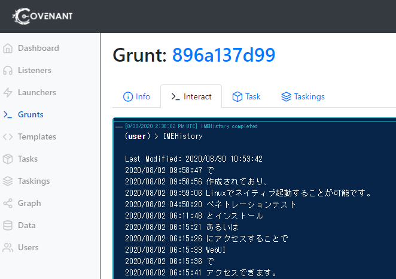

# IMEHistory for Convenant

Covenant Task to display IME history in Japanese environment.

Ported from CobaltStrike Beacon Object File in the following repository.

https://github.com/sysenter-eip/imppred_parser

> **JpnIHDS.dat** contains last Japanese input from the user (Japanese IME keyboard). Use this source code to parse it.

# Example

# Reference

- JpnIHDS.dat – File Format Details and the parser introduction
  - https://ierae.co.jp/blog/jpnihds_en/  
  - (日本語) https://ierae.co.jp/blog/jpnihds_jp/